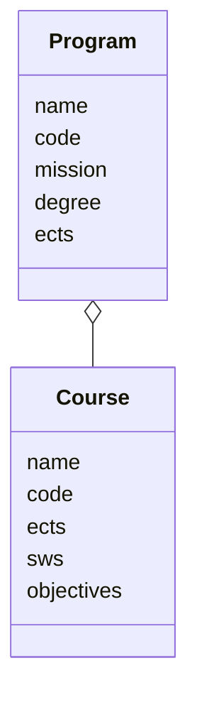
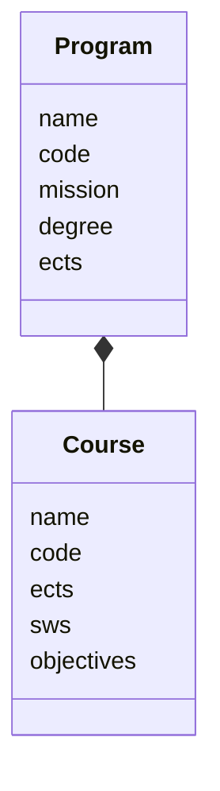

classDiagram 
    
    class Course{
      name
      code
      ects
      sws
      objectives
    }
    class Program{
      name
      code
      mission
      degree
      ects
    }
    Program "*"--"*" Course

classDiagram 
    
      class Program{
      name
      code
      mission
      degree
      ects
    }
    
    class Course{
      name
      code
      ects
      sws
      objectives
    }
  
    Program ~~ Course
     class CourseProgram{
        semester
        required
    }
    
    Program "1"--"*" CourseProgram
    Course "1"--"*" CourseProgram
   
