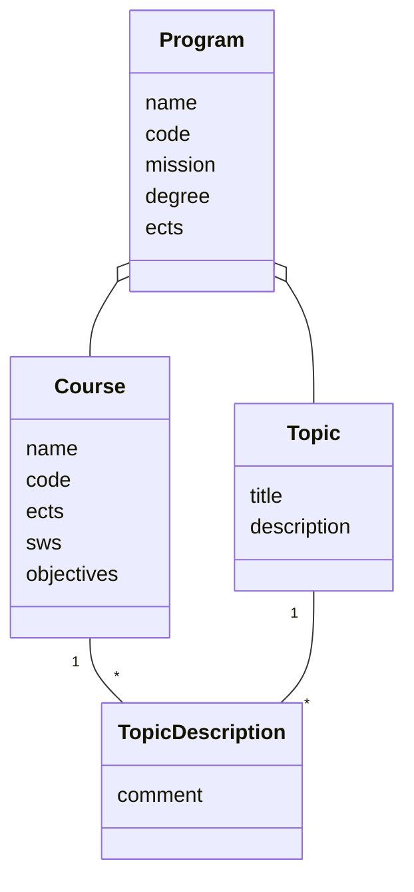

# 

```mermaid
classDiagram
 
  
    class TopicDescription{
       comment
    }

    class Topic{
        title
        description
    }
    Program o-- Topic

    Course "1"--"*" TopicDescription
    Topic "1"--"*" TopicDescription

    class Program{
      name
      code
      mission
      degree
      ects
    }
    %%class CourseProgram{
    %%    semester
    %%    required
    %%}
    class Course{
      name
      code
      ects
      sws
      objectives
    }

    Program o-- Course
    %% Program "1"--"*" CourseProgram
    %% Course "1"--"*" CourseProgram
   
     


     

```