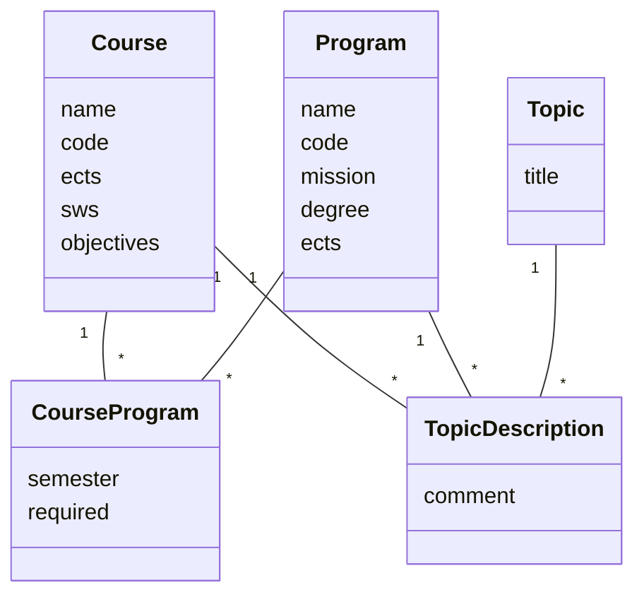

## mermaid



## from db/schema.rb
```ruby
  create_table "topic_descriptions", force: :cascade do |t|
    t.bigint "topic_id", null: false
    t.string "implementable_type", null: false
    t.bigint "implementable_id", null: false
    t.text "description"
    t.datetime "created_at", null: false
    t.datetime "updated_at", null: false
    t.text "comment"
    t.index ["implementable_type", "implementable_id"], name: "index_topic_descriptions_on_implementable"
    t.index ["topic_id"], name: "index_topic_descriptions_on_topic_id"
  end

  create_table "topics", force: :cascade do |t|
    t.string "title"
    t.datetime "created_at", null: false
    t.datetime "updated_at", null: false
    t.text "comment"
  end
```

